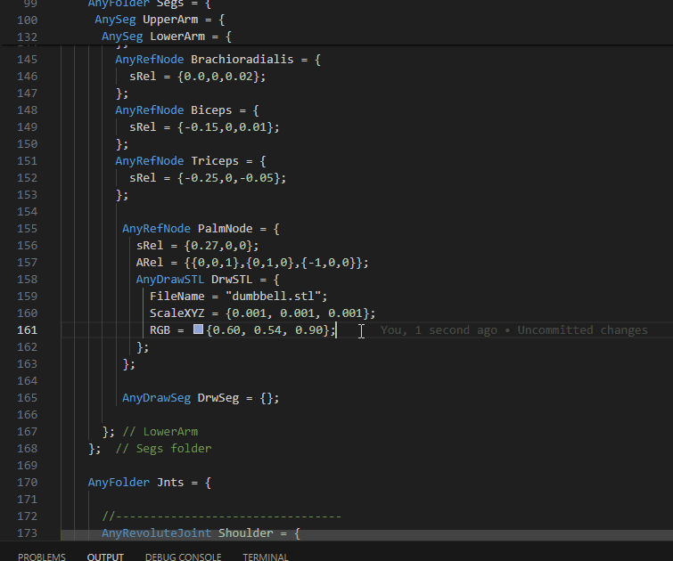
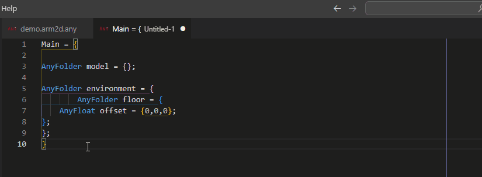

# AnyScript README

The AnyScript extension is a Visual Studio Code extension that provides syntax highlighting and snippets for the AnyScript language.

## Features

### Syntax Highlighting

The extension provides syntax highlighting for the AnyScript language. The extension highlights AnyScript classes, functions, and constants.

### Snippets

The extension provides snippets for the AnyScript language. The snippets are are work in progress and will be updated in the future.

### RGB Color Picker

The extension provides a color picker for RGB colors. The extension recognizes RGB colors in the format `RGB = {1, 0.2, 0.0};` and provides a color picker when you hover over the color.

### Code Formatting

The extension provides a simple yet handy document formatter for .any files. You can use both the `Format Document` and `Format Selection` commands. The formatter ensures consistent indentation, spacing, and line breaks according to the AnyScript language conventions.

To format an entire document, right-click within the editor and select `Format Document`, or use the default keyboard shortcut `Shift+Alt+F`.

To format a selected portion of the document, highlight the desired text, right-click, and select `Format Selection`, or use the default keyboard shortcut `Ctrl+K Ctrl+F`.

## Change Log

All notable changes to the "anyscript" extension will be documented here.

### 0.2.5

#### Fixed

- A bug in the formatter functions was fixed to avoid breaking conditional logic

### 0.2.3

### Added

- Added support for `Format Document` and `Format Selection` in .any files

### 0.2.0

#### Added

- Added color picker for RGB colors
- New AnyScript class, function, and constant highlighting
- Improved language configuration

### 0.1.4

- Initial release

## License

This project is licensed under the MIT License - see the [LICENSE](LICENSE) file for details.
